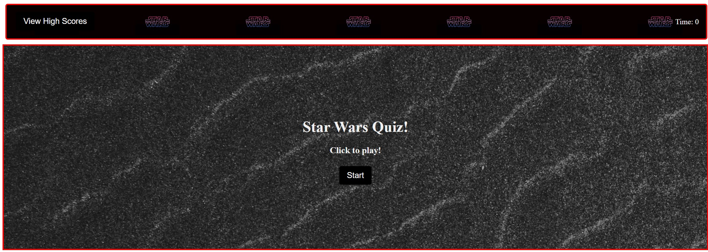
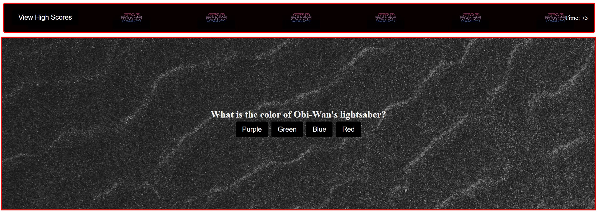
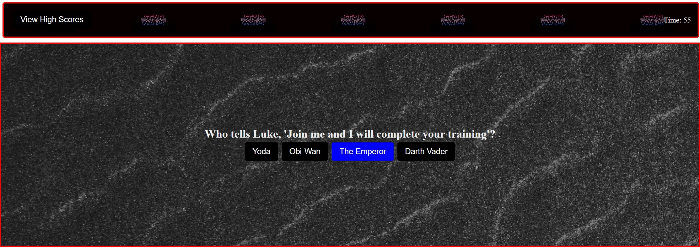
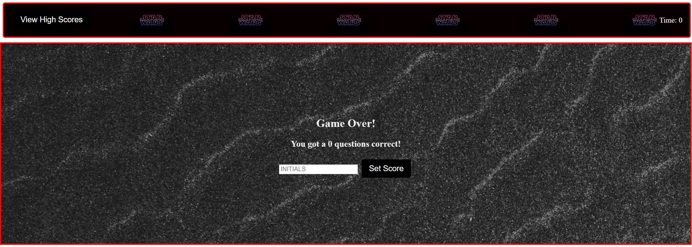
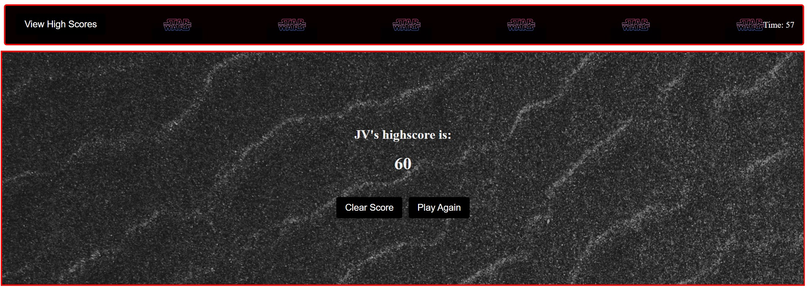

## Challenge: Code Quiz

1. [ Description. ](#description)
2. [ Web Address. ](#link)
3. [ Usage tips. ](#quiz)


<a name="description"></a>
## 1. Description


### This is a Star Wars quiz using HTML, CSS, and Javascript.

This code was created with a great amount of sweat, sleep-less nights, but most importantly a lot of FUN.


Desktop screen-shot:




<a name="link"></a>
## 2. How to Get There

### Enter the following web address to access.

```html
https://jaimevilches87.github.io/Code-Quiz/
```
<a name="quiz"></a>
## 3. How to Get Started


### Click Start


### Quiz starts with a 75 seconds countdown



### Answer each question to get to the next question. There are 4 total questions.
#### If answer is wrong, 15 seconds will be taken off the time.




### Quiz ends when all questions are answered or time hits 0.
#### When quiz is over, the user will be able to enter their initials to save the score.




### End quiz details
#### User's highscore will be displayed in all Upper Case regardless of input.
#### User will then have the option to Clear Score or Play again. 




### Click on View High Scores to check your quiz score!


